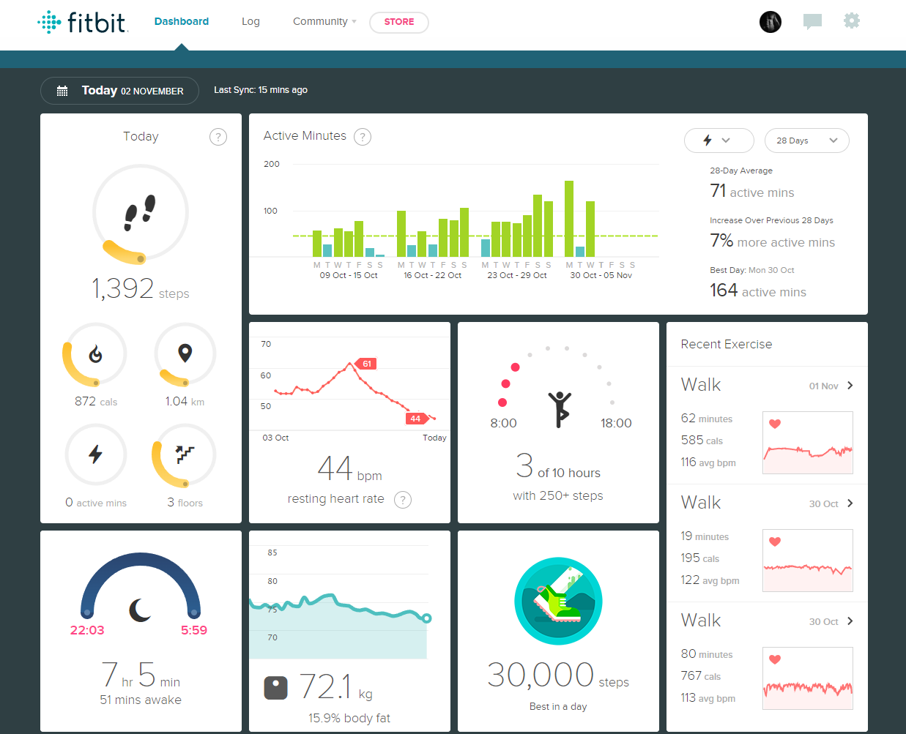
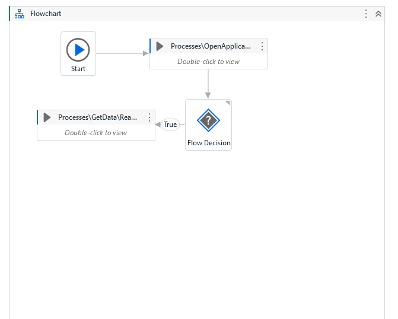
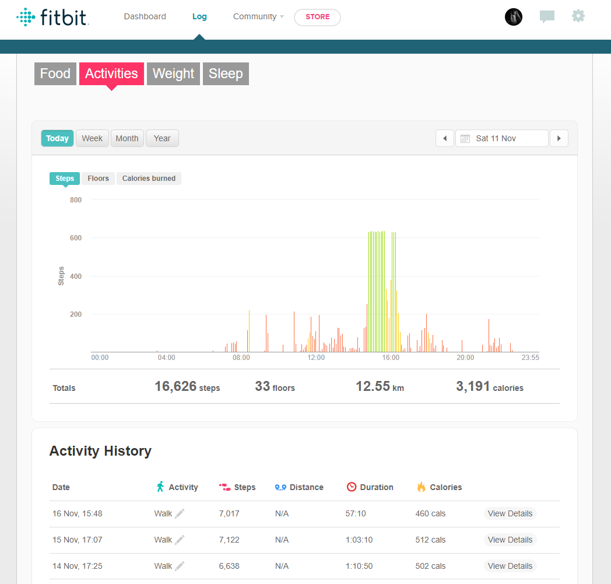

# fitbit-data-xtractor
A Bot created to extract data and statistics from Fitbit website.

The  application uses Robotic Process Automation to extract data and statistics from Fitbit website and write retrieved data into an excel file.

## Features

- Extracts data such as Calories consumed and burned, nutritions, activites and sleep, from the Fitbit.com website.
- Write data to Excel files
- Synchronize all the extracted data and write them into one final excel table.

#### Flowchart Processes

- Start application. 
Opens the Chrome Browser on the fitbit.com website
- Flow Decision 
if the website is succesfully opened it directs the workflow to get data processes.
If the website is not succesfully opened it directs the flowchart to closing browser process.
- Invoke Workflow ReadWeightData.
Extract data from the Weight page, such as Date, Weight and Body Fat.
Assigns this values into a temporary excel file.
- Invoke Workflow GetActivityData
Extract data from the Activity page, such as Calories Burned, Nunber of Steps, Floors and Distance.
Assigns this values into a temporary excel file.
- Invoke Workflow GetCaloriesAndNutritions
Extract data from the Food page, such as Calories consumed, Fat, Fiber, Carbohydrates, Sodium, Proteins and Water.
Assigns this values into a temporary excel file.
- Invoke Workflow GetSleepData
Extract data from the Sleep page, such as sleep start time, sleep end time and sleep duration.
Assigns this values into a temporary excel file.
- Close All Applications.
- Merge Tables
Proces all data from temporary files and generate the final ouput file.

### Page

### Future Features

- Credentials
- Add Activities Details extraction
- Add Sleep Details extraction

## Tools & Technologies Used

- UiPath
- Microsoft Excel

## Database Design

No data base is used at this stage of the application. It is considering to use some kind of data storage for small pieces of informations, such as players result to be stored in the browsers storage.

## Deployment
There is not deployment available at the moment.

## Local Deployment
In order to make a local copy of this project, you can clone it. In your IDE Terminal, type the following command to clone my repository:

git clone https://github.com/TomaszWoloszyn983/fitbit-data-xtractor

## Testing

### Unfixed errors and Bugs
- Activity Data don't update properly.
During updating previuosly exctracted data, an attempt of updating the data causes an issue that all data except of the Activity Data (Calories consumed, Steps, Floors and Distance) are not updated properly.
The bug is caused by the fact that at the first extraction the data are writen to excel in ascending order, from the oldest to the newest, after an update the new data are added on the top of the table, above the oldest data.

Potential solution is to add the new data at the end of the table.

## Credits

### Acknowledgements
