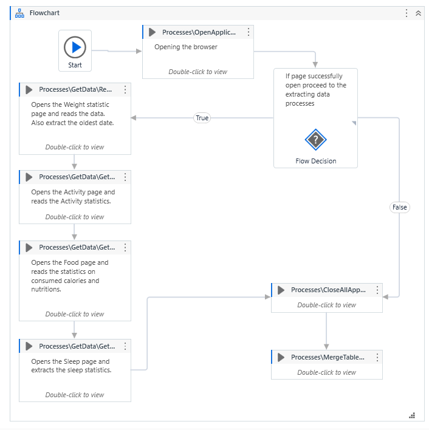

# fitbit-data-xtractor
A Bot created to extract data and statistics from Fitbit website.

The  application uses Robotic Process Automation to extract data and statistics from Fitbit website and write retrieved data into an excel file.

## Features

- Extracts data such as Calories consumed and burned, nutritions, activites and sleep, from the Fitbit.com website.
- Write data to Excel files
- Synchronize all the extracted data and write them into one final excel table.

### Page

### Future Features

- Credentials
- Add Read Activities Details process
- 

## Tools & Technologies Used

- UiPath
- Microsoft Excel

## Database Design

No data base is used at this stage of the application. It is considering to use some kind of data storage for small pieces of informations, such as players result to be stored in the browsers storage.

## Deployment

## Local Deployment
In order to make a local copy of this project, you can clone it. In your IDE Terminal, type the following command to clone my repository:

git clone https://github.com/TomaszWoloszyn983/fitbit-data-xtractor

## Credits

### Acknowledgements
